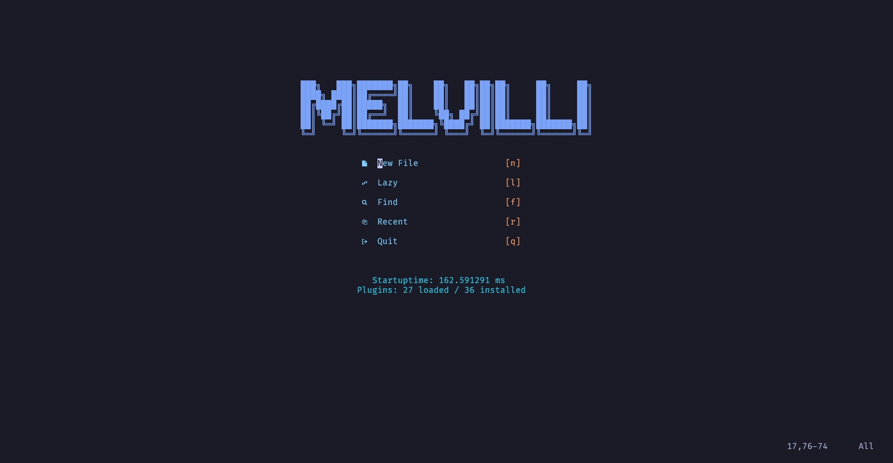
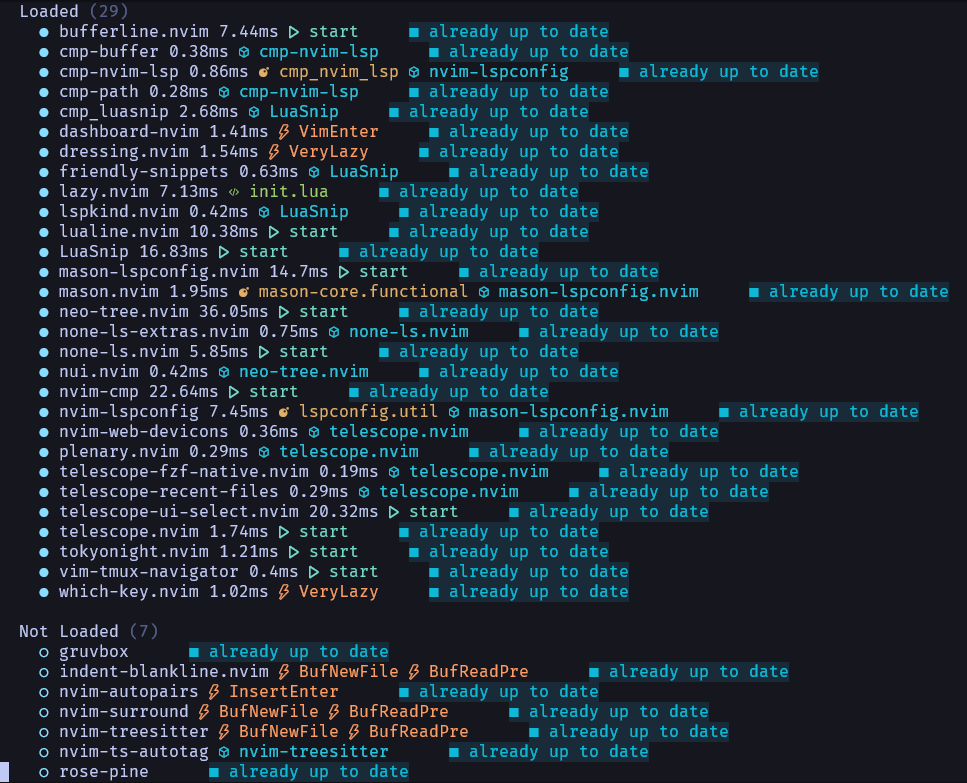
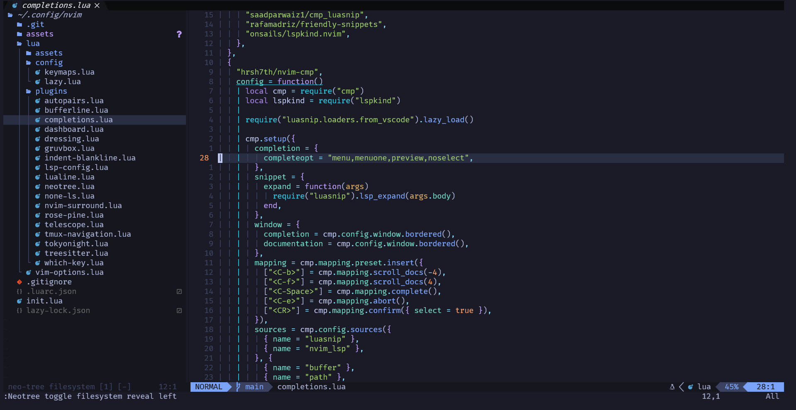
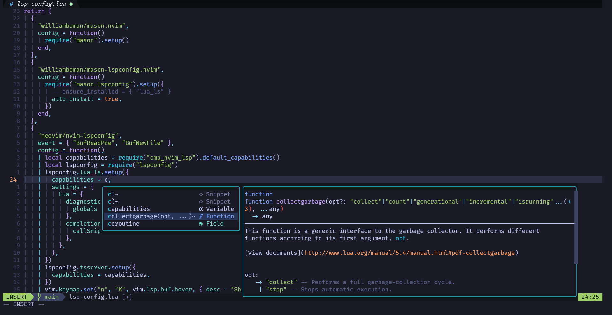

# neoIDE
## ✨ My personal neovim setup

## ✨ Features & Plugins

- 📦 Has a little bunch of useful plugins.
- 🚀 Fast startup time due to low but useful plugins.
- 💤 Low resource footprint due to lazy loading.
- 📈 Statusline component to see the number of pending updates.
## ✨ Getting Started
1). Backup current neovim config if any
```bash
cp $XDG_CONFIG_HOME/nvim ~/nvim.bak
```
2). Clone this repo into your ``$XDG_CONFIG_HOME`` directory as `nvim`
```bash
git clone --depth=1 --single-branch -b main https://github.com/69keks/neoIDE.git $XDG_CONFIG_HOME/nvim
```
3). ??????  
4). Profit!!! Just run neovim and wait till lazy bootstraps!
## ✨ Workflow


